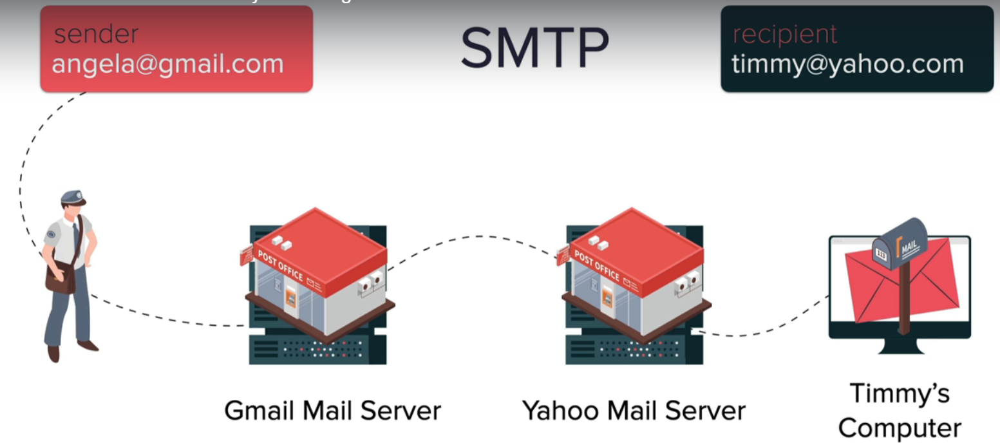
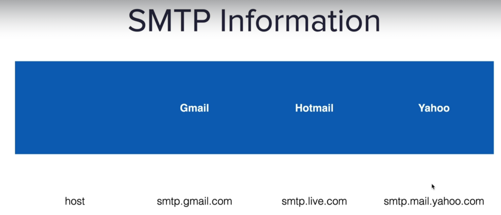
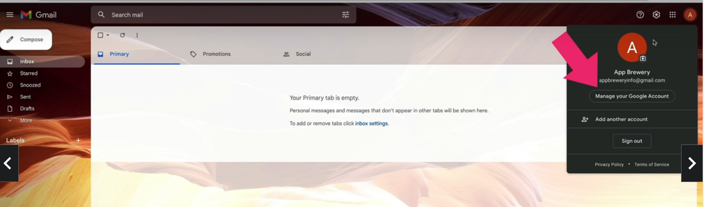
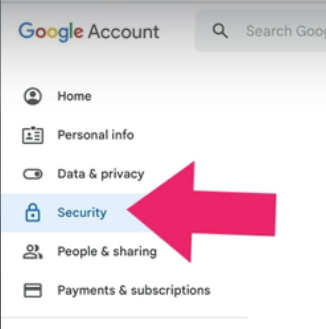
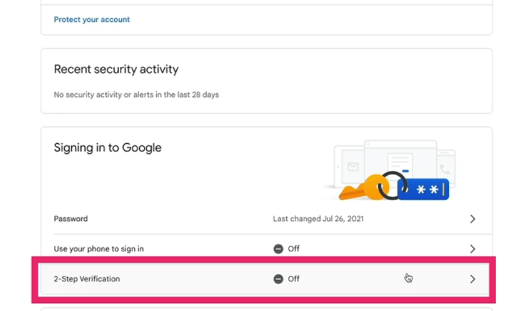
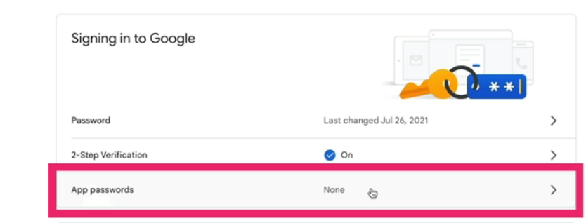
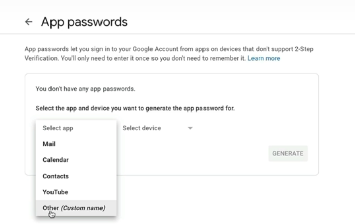

## Day 32- Automated Birthday Card Email
AIM: Email SMTP and datetime module

# Important notes
## SMTP
- SMTP = Simple Transfer Protocol
- An application that is used by mail servers to send, receive and relay outgoing email between senders and receivers
- 
- import smtplib #Importing SMTP library
- connection = smtplib.SMTP("smtp.gmail.com") #creating an object using smtplib with parameter as spectific server(such as smtp.gmail.com)
- 
- connection.starttls #tls is transport layer security, for making connection secure
- connection.login(user="my_email", password="password") #login to email server
- connection.sendmail(from_addr="my_email", to_addrs="recipient_email, msg='Hello") 

## Datetime
- import datetime as dt     #importing datetime module
- now = dt.datetime.now()   #now() method includes the all the time including the year, month, day, time etc
- year = now.year           #can specify select the year attribute from the now
- print(type(now))          #returns as a datetime object
- print(type(year))          #returns an integer type, hence able to do condition check on it 
- day_of_week = now.weekday() #specify week day attribute
- print(day_of_week)        #returns an integer. If "1" means tuesday, since counting start from 0
- date_of_birth = dt.datetime(year=1995,month=12,day=25) #year, month, day is the only requirement for datetime object. This returns "1995-12-15 00:00:00" with 00hrs,mins,secs as default value
- 

## Steps for Special Password for SMTP GMAIL PYTHON APPLICATION
1) Go to manage Google account

2) Go to security

3) Turn on 2-step Verification

4) After verification with OTP, app passwords section should appear

5) Create other(custom name), name it "birthday_wisher", then click on Generate

6) Copy the app password into the codes

## Automated Birthday Card Email project
file: mywork.py

