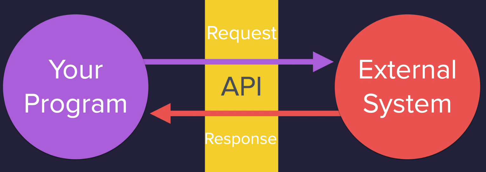
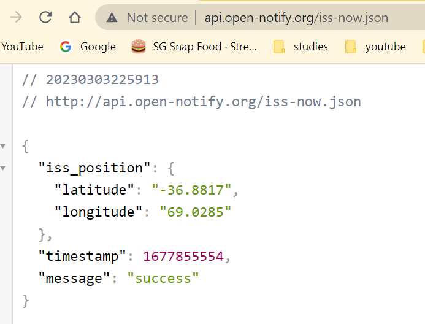
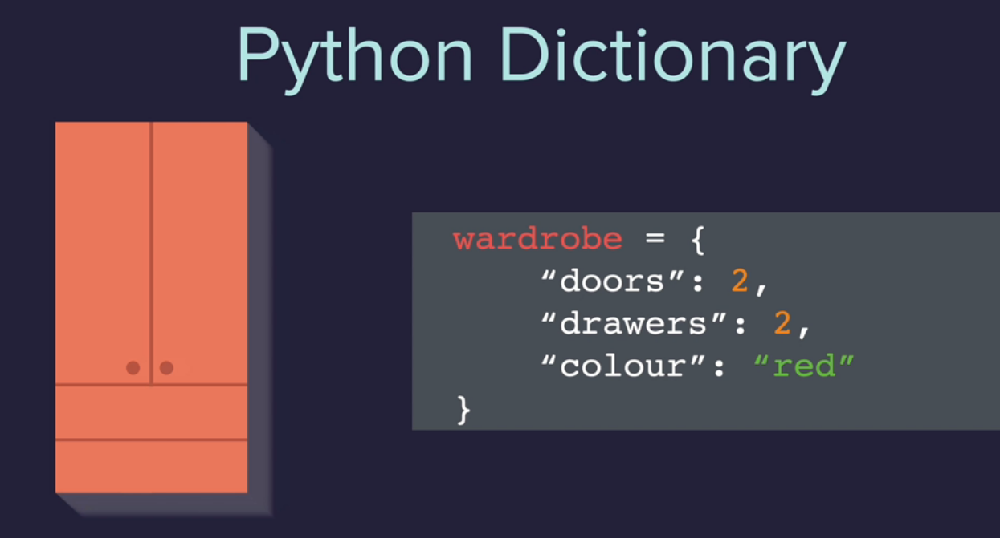
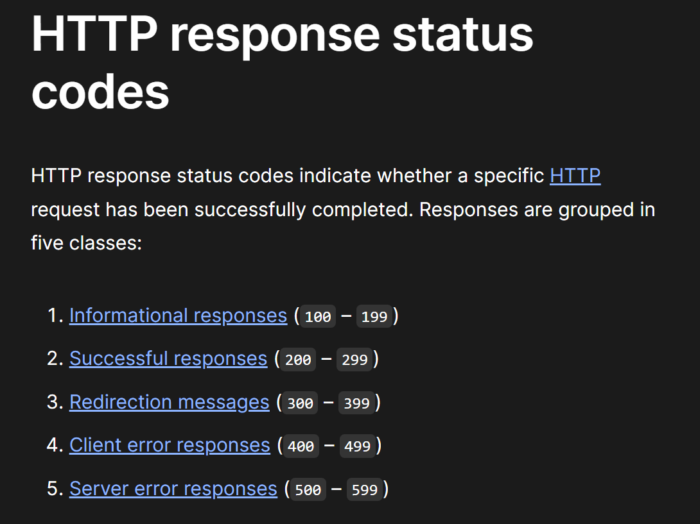
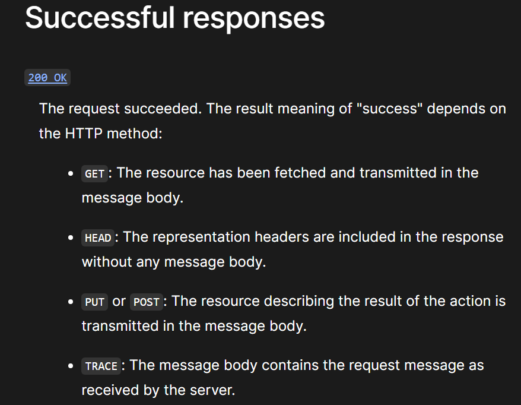
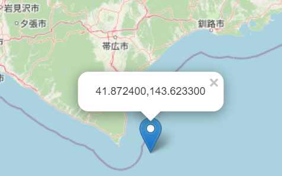
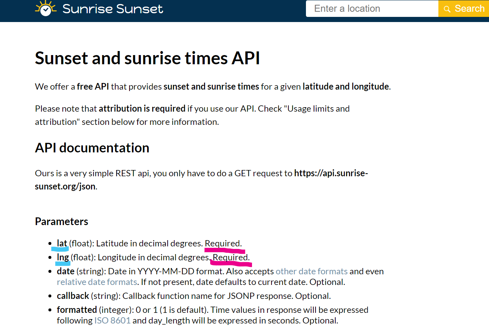
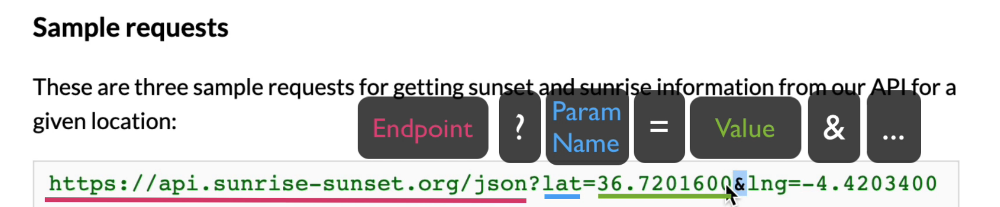
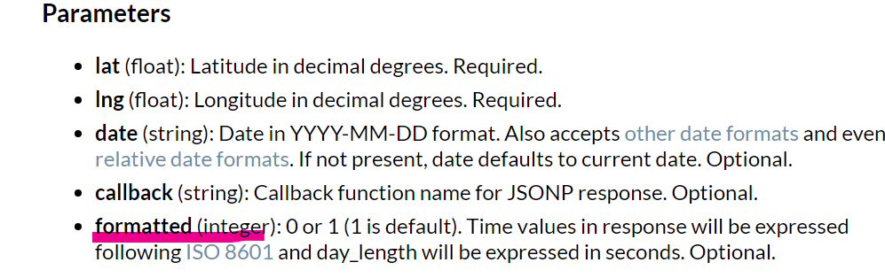
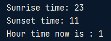

# API - Application Programming Interface

Notes:
An Application Programming Interface (API) is a set of commands, functions , protocols and objects that programmers can use to create software or interact with an external system


## What is API endpoint?
- When an API interacts with another system, the touchpoints of this communication are considered endpoints.
- Example if we copy the endpoint to a browser, it will return a JSON of the available information
- http://api.open-notify.org/iss-now.json
- 

## What is JSON?
- JSON stands for JavaScript Object Notation
- JSON is a lightweight format for storing and transporting data
- JSON is often used when data is sent from a server to a web page
- Differences between a python dictionary and JSON show in the pictures
- 
- 

## Note: Responses (learning.py)
- Upon executing the code, we get this response[200]
```
import requests 

response = requests.get(url="http://api.open-notify.org/iss-now.json")
print(response)

results: <Response [200]>
```
- this in fact means it is a successful responses
- https://developer.mozilla.org/en-US/docs/Web/HTTP/Status#successful_responses
- 
- 
- Hence with the response.status_code, we can set conditions for failed execution
```
import requests
response = requests.get(url="http://api.open-notify.org/iss-now.json")
response.raise_for_status()
```
In order to view the response data, use this
```
data = response.json()
print(data)

Result:
{'iss_position': {'latitude': '27.8933', 'longitude': '124.6004'}, 'timestamp': 1677856894, 'message': 'success'}
```
In order to narrow to get the only required data such as longitude or latitude, we can use square brackets
```
longitude = data["iss_position"]["longitude"]
latitude = data["iss_position"]["latitude"]
iss_postion = (longitude,latitude)
print(iss_postion)

Result:
('124.6004', '27.8933')
```
- By pasting the coordinates into the website: https://www.latlong.net/Show-Latitude-Longitude.html
- We can see the current location of the ISS
- 

## Kanye's Quotes API (learning2.py)
- Website : https://kanye.rest/
- API Endpoint: https://api.kanye.rest

By using the kanye api, we are able to pull the kanye's quotes from the API and added to our TK display
```
from tkinter import *
import requests


def get_quote():
    response = requests.get("https://api.kanye.rest/") #API endpoint
    response.raise_for_status() #raise for status
    data = response.json()["quote"] #getting the quotes
    canvas.itemconfig(quote_text, text=data)


window = Tk()
window.title("Kanye Says...")
window.config(padx=50, pady=50)

canvas = Canvas(width=300, height=414)
background_img = PhotoImage(file="background.png")
canvas.create_image(150, 207, image=background_img)
quote_text = canvas.create_text(150, 207, text="Kanye Quote Goes HERE", width=250, font=("Arial", 30, "bold"), fill="white")
canvas.grid(row=0, column=0)

kanye_img = PhotoImage(file="kanye.png")
kanye_button = Button(image=kanye_img, highlightthickness=0, command=get_quote)
kanye_button.grid(row=1, column=0)

```


## Sunset and Rise API (API Parameters)(learning3.py)
- Some API has parameters such as https://sunrise-sunset.org/api
- 
- we can see how API want us to structure the parameter such as lat, lng
- And how some parameters are required in order to work
- How to specify parameter with the endpoint
- 
- ### Optional parameter
```
import requests 
from datetime import datetime

MY_LAT = 1.297588
MY_ING = 103.854309

parameters = {
    "lat": MY_LAT,
    "lng": MY_ING,
}

response = requests.get("https://api.sunrise-sunset.org/json", params=parameters)
response.raise_for_status()
data = response.json()
print(data)

results: 
{'results': {'sunrise': '11:12:47 PM', 'sunset': '11:20:24 AM', 'solar_noon': '5:16:36 AM', 'day_length': '12:07:37', 'civil_twilight_begin': '10:53:03 PM', 'civil_twilight_end': '11:40:09 AM', 'nautical_twilight_begin': '10:28:52 PM', 'nautical_twilight_end': '12:04:19 PM', 'astronomical_twilight_begin': '10:04:42 PM', 'astronomical_twilight_end': '12:28:30 PM'}, 'status': 'OK'}
```
- The codes above gave us the 'sunrise' and 'sunset'. We want to find out the hour of sunrise and hour of sunset.
- However, the time is in 12 hours format. 
- In order to change to 24 hours format, we can use the optional parameter
- 
- Hence by adding "formatted": 0 into the parameter, we can get the 24 hours format.
```
{'results': {'sunrise': '2023-03-02T23:12:47+00:00', 'sunset': '2023-03-03T11:20:24+00:00', 'solar_noon': '2023-03-03T05:16:36+00:00', 'day_length': 43657, 'civil_twilight_begin': '2023-03-02T22:53:03+00:00', 'civil_twilight_end': '2023-03-03T11:40:09+00:00', 'nautical_twilight_begin': '2023-03-02T22:28:52+00:00', 'nautical_twilight_end': '2023-03-03T12:04:19+00:00', 'astronomical_twilight_begin': '2023-03-02T22:04:42+00:00', 'astronomical_twilight_end': '2023-03-03T12:28:30+00:00'}, 'status': 'OK'}

```
- In order to split the 2023-03-02T23:12:47+00:00, we can use split("T")
- And we get ['2023-03-02', '23:12:47+00:00']
- Select the 2nd element in the list and perform another split(":")
- And we get ['23','12','47+00', '00']
- Select first element in the list and we get the hour integer
- Hence the code
```
sunrise = data["results"]["sunrise"].split("T")[1].split(":")[0]
sunset = data["results"]["sunset"].split("T")[1].split(":")[0]

```
Result:



## Final Project- ISS Overhead Email System
- Check if the ISS satellite is overhead the desired location (plus minus 5 degrees error of margin in latitude and longitude)
- If it does and it is night time, send an email
- 